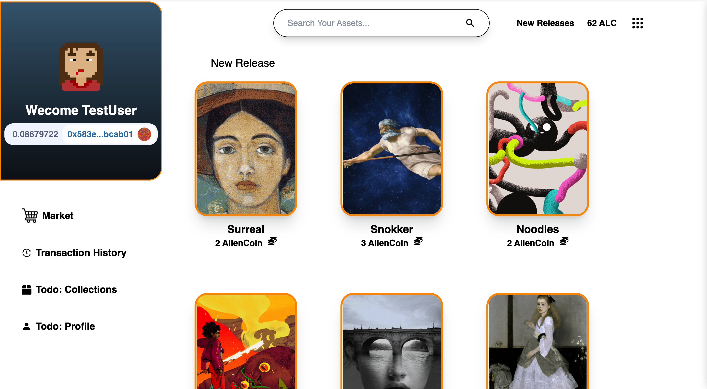
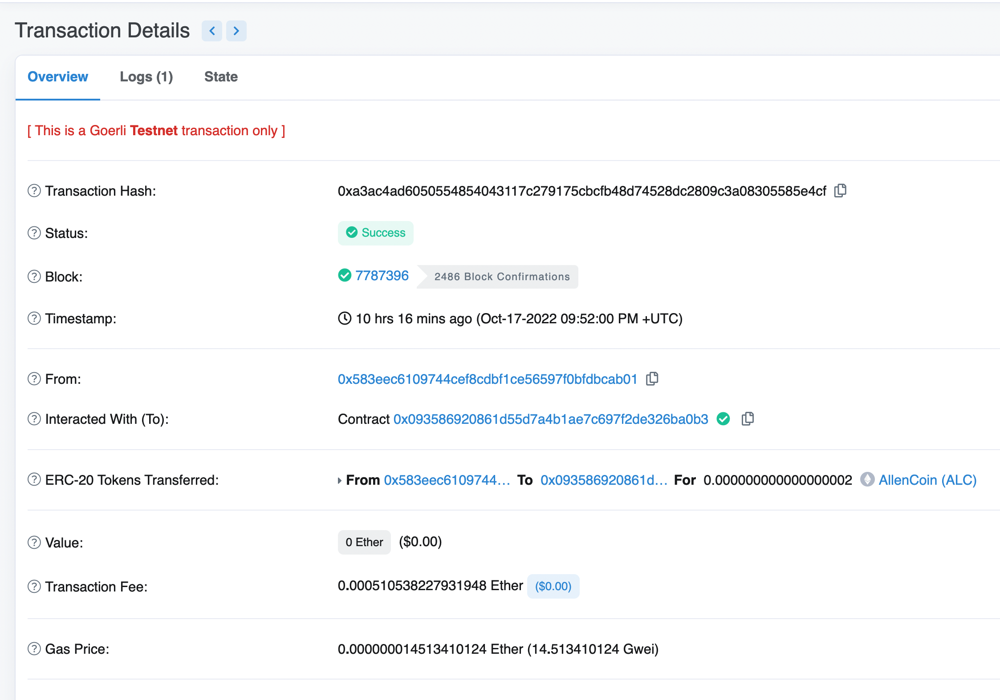

## Web3.0 Artwork Store

- [Introduction](#Introduction)
- [Demo](#Demo)

## Introduction

This is a web artwork 3.0 store featuring my own web3.0 currency - AllenCoin, where user can trade with ETH, and purchase artwork assets and view their purchase history.

Link to my [Demo](#Demo)

To have the best experience, please:

- Install MetaMask extension, and switch to Georli test network.
- Create a wallet and obtain some free test ETH from [Georli Faucet](https://goerlifaucet.com/).
- Click the ALC balance on the top right to exchange some AllenCoin.
- Purchase any artwork you'd like!
- Checkout the purchase history (Might have some delay).

## Demo

Live website demo link: [Here](https://web3artstore.netlify.app)

Screenshots:

- Website view:
  

- Etherscan AllenCoin Token information:
  

- Purchase AllenCoin:
  

- Purchasing AllenCoin via Metamask:
  

- Sucessful AllenCoin trade message:
  

- Purchase Asset:
  

- Successful artwork purchase message:
  

- View Transaction History
  

- Etherscan Transaction Receipt:
- 

## Installation and Running this project

- Download from Github
- Run yarn install
- Configure Moralis database (NEXT_PUBLIC_MORALIS_SERVER and NEXT_PUBLIC_MORALIS_APP_ID)
- Run yarn dev
