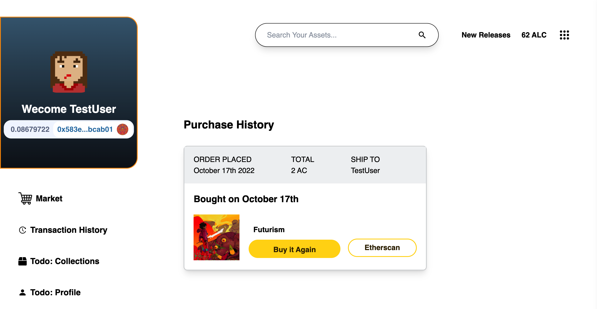

## Web3.0 Marketplace

- [Introduction](#Introduction)
- [Demo](#Demo)

## Introduction

This is a web 3.0 marketplace featuring my own created currency - AllenCoin, where user can trade with ETH, and purchase assets and view their purchase history.

Link to my [Demo](#Demo)

To have the best experience, please:

- Install MetaMask extension, and switch to Georli test network.
- Create a wallet and obtain some free test ETH from [Georli Faucet](https://goerlifaucet.com/).

## Demo

Live website demo link: [Todo](#demo)
Screenshots:

- Website overall view:
  
- Purchase AllenCoin:
  
- Purchasing AllenCoin via Metamask
  
- Purchase Asset:
  
- Success message:
  
- View Transaction History
  

## Installation and Running this project

- Download from Github
- Run yarn install
- Run yarn dev
